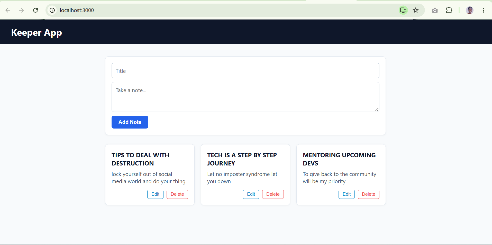
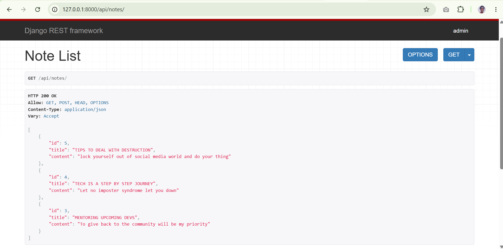
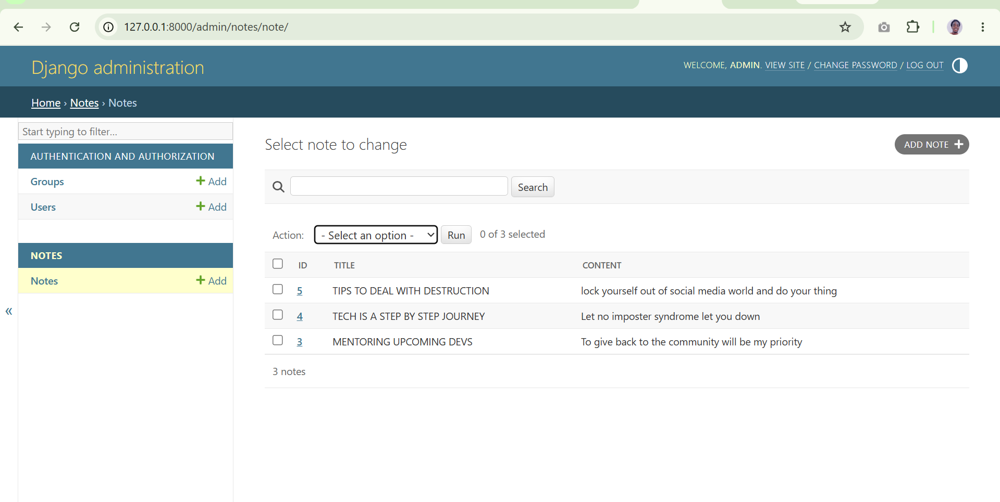

# Full-Stack Keeper App (Django REST Framework + React)

A CRUD application featuring a Django REST Framework API backend and a dynamic React frontend.

---

## Visual Overview

### 1. React Frontend UI


### 2. Django REST API View (`/api/notes/`)


### 3. Django Admin Dashboard


---

## Features
- **Complete CRUD Operations**: Create, Read, Update, and Delete notes with real-time UI synchronization.
- **Architecture**: Django REST Framework serving JSON endpoints; React handling client-side state and async HTTP requests.
- **Admin Dashboard**: Custom `ModelAdmin` configuration providing search and filtered list views.

---

## Project Structure

```text
keeper_app/
├── backend/
│   ├── core/
│   ├── notes/
│   ├── db.sqlite3
│   ├── manage.py
│   └── requirements.txt
├── frontend/
│   ├── src/
│   │   ├── App.js
│   │   ├── App.css
│   │   └── index.js
│   └── package.json
├── screenshots/
│   ├── frontend-ui.png
│   ├── api-endpoint.png
│   └── django-admin.png
├── .gitignore
└── README.md
```
```bash
cd backend
python -m venv venv
# On Windows:
venv\Scripts\activate
# On macOS/Linux:
# source venv/bin/activate

pip install -r requirements.txt
python manage.py migrate
python manage.py runserver
```
```bash
cd frontend
npm install
npm start
```
